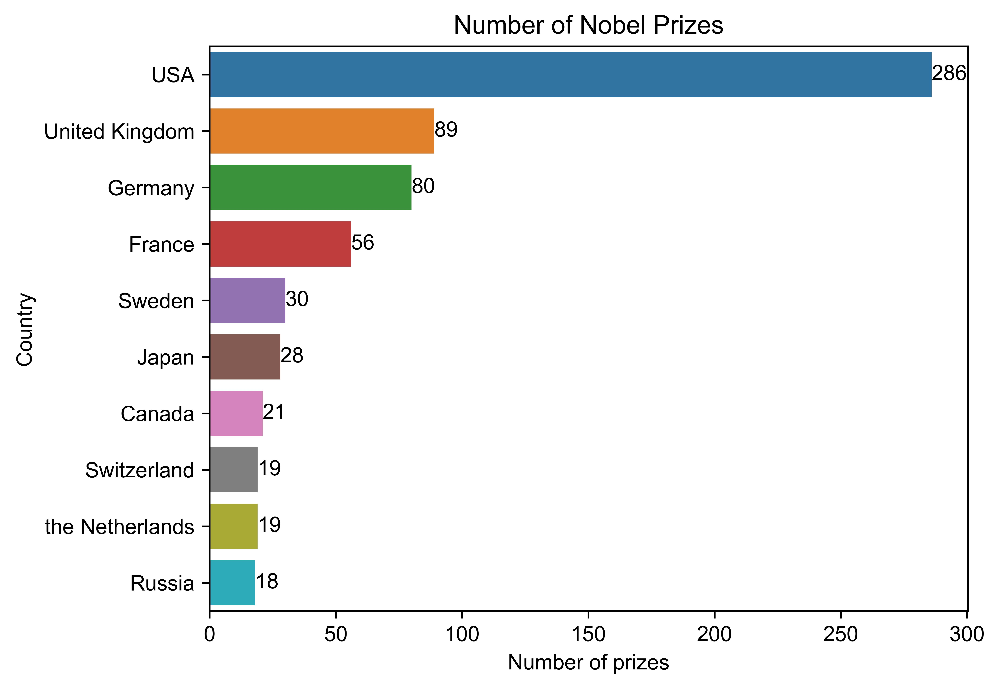
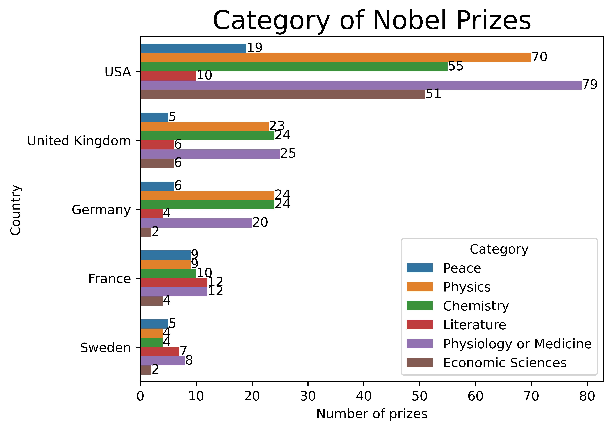
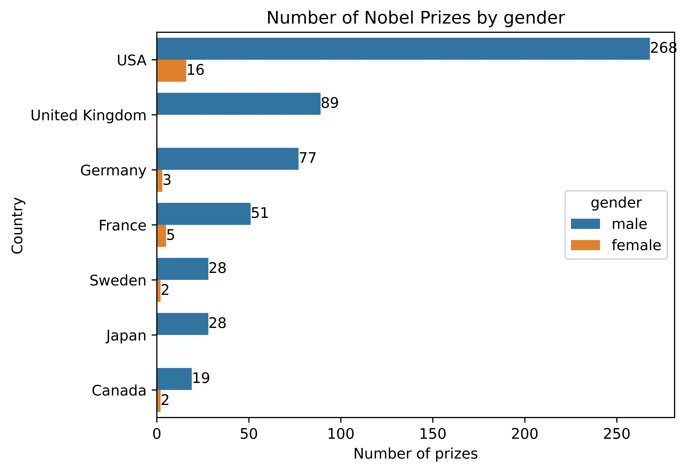
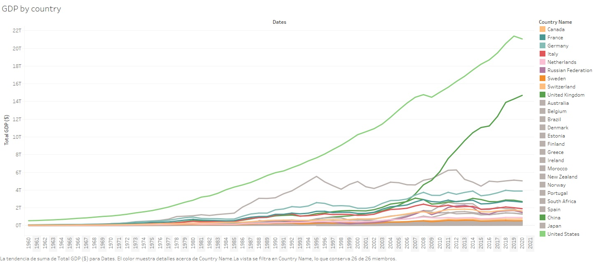
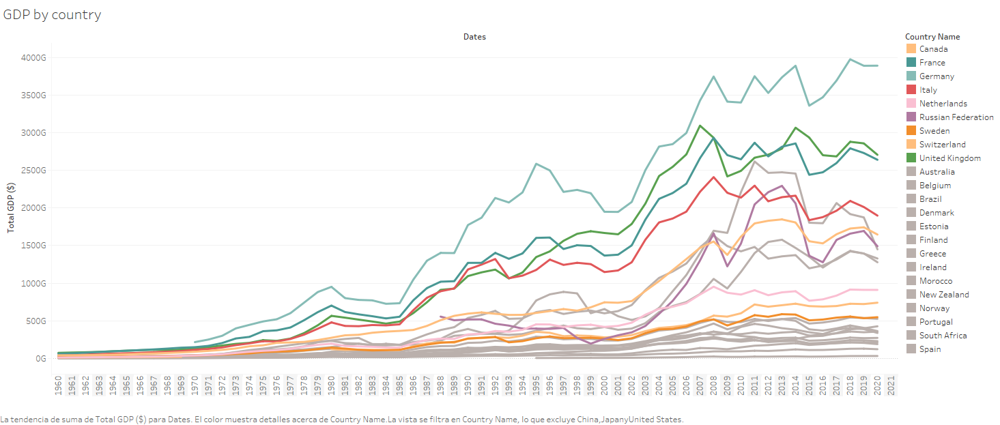

 
 
 

 
 

# NOBEL AWARDS ANALYSIS    🥇

 

### OBJECTIVE OF THE ANALYSIS

The main goal of this project is analyze three datasets about the Nobel Awards, GDP and PISA reports. The initial questions and hypothesis are the next:

- Which are the countries with the most number of people awarded. Is the difference being reduced on the last years?
- Is there a bias in the categories of the awards depending of the countries.
- Is there a bias in the gender of the awarded? Is it being reduced or increased?
- Is the number of awards related to the country GDP?
- Is the number of awards related to the education levels of the country according to the PISA report?
 

### DATA OBTAINING

In order to collect all the data I have use an API to obtain the Nobel Prizes dataset and perform an analysis of that dataset. On this case I have used the [Nobel Awards API](https://www.nobelprize.org/about/developer-zone-2/). In order to complete the analysis I have obtained another dataset from the [World Bank](https://databank.worldbank.org/home.aspx) site and the Pisa Report from the last years from the [OECD](https://www.oecd.org/pisa/) site. 
 

### CODING

In order to connect to the API, clean the datasets and execute the diferent functions I have created different Jupyter Notebooks and Python files inside the [SRC](https://github.com/GuilleNes/Project_2.0/tree/main/Src) folder.
 

### ANALYSIS

#####1. In order to begin with the analysis, we are going to see which are the countries with the most awarded people:

As we can see above, USA is far the most awarded country since the creation of the Nobel Prize followed by UK and Germany. We will analyze later if this is more related to the whealth or the education levels on this countries.
 

#####2. Now we are going to analyze the different categories of the countries awards:

We can see that the Anglosaxon countries are more focused on Science than Literature, for instance. The balance between the categories are more equal in countries like France.
 

#####3. On the next hypothesis, we are going to focus on the gender of the awardee.

As we can see above, there is a huge difference between the gender of the awardees. For instance, the UK do not have any female awardee. Despite on the last years more women have been awarded with the Nobel, we are not able to conclude that the tendency has increased yet. The difference between the male and female gender is still huge. 
 

####4. Next, we are going to see if there is any correlation between the GDP (wealth) of the countries and the number of awards they have:

On the dashboards above, we can see two the evolution of the GDP on the last 60 years of the countries with the most numbers of Nobel Awards and some of the wealthiest others. On the second one we have skipped the USA, China and Japan, in order to have a more visual plot. In both cases, we can see that the countries with the most number of Nobel awards are those located on the top positions of the GDP chart.
 

####5. Finally, we are going to analyze if the number of Nobel awards is related to the education system levels of each country. Here we have the PISA report of 2015 and the average of the three performing tests.

As we can see on the graph above, there is not relation between the quality of the education in the different countries as the US is on the average of the results and some of the countries with the best results, are not in the top of the Nobel awarded countries.

 
 
 
[Other graphs from tableau](https://public.tableau.com/shared/4JD9494C5?:display_count=n&:origin=viz_share_link)
 
 
 
 
 
 
